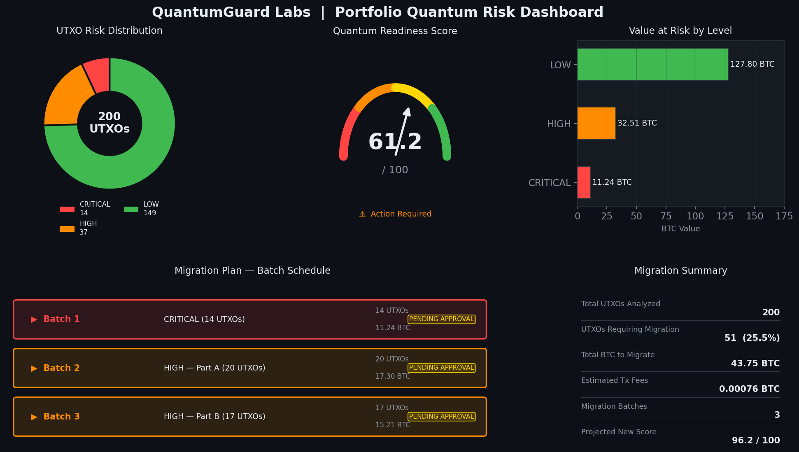
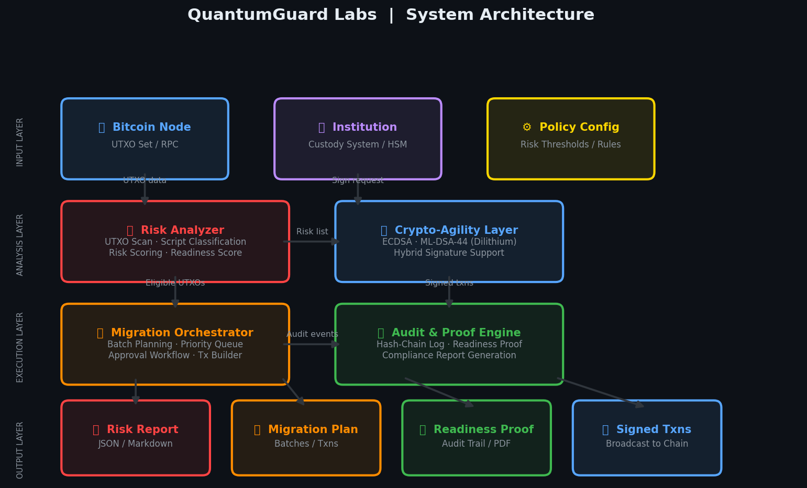

# QuantumGuard Labs - 量子安全迁移平台 (QMP)

[](https://github.com/lutiangao1998/quantumguard-labs/actions) [](https://opensource.org/licenses/MIT) [](https://www.python.org/downloads/release/python-3110/)

**保卫数字资产，跨越量子时代的基础设施。**

---

### 风险分析仪表盘 (Demo)



---


QuantumGuard Labs 提供了一个工程化的平台，用于识别、迁移和保护面临量子计算威胁的数字资产。我们填补了区块链协议抗量子升级与存量资产安全之间的关键工程空白，为机构级用户提供可落地的解决方案。

> **核心问题**：量子计算机的出现将破解当前广泛使用的公钥密码体系（如 ECDSA），使大量存量比特币（及其他数字资产）面临被盗风险。本项目旨在提供一个系统化的工具，在“量子黎明”到来之前，安全地将这些风险资产迁移到抗量子攻击的地址上。

## 核心功能

平台围绕“诊断-迁移-敏捷-证明”的全生命周期构建，提供四大核心功能：

1.  **风险分析器 (Exposure Analyzer)**
    -   **全链分析**：深度扫描比特币 UTXO 集，识别因公钥暴露（如 P2PK）或地址重用（如 P2PKH）而面临风险的资产。
    -   **风险量化**：对每项资产进行量子攻击风险分级（CRITICAL, HIGH, MEDIUM, LOW），并生成投资组合的整体“量子就绪度评分”。

2.  **迁移编排器 (Migration Orchestrator)**
    -   **策略驱动**：基于可定制的策略（如风险等级、资产价值、批次大小）自动生成迁移计划。
    -   **安全可控**：支持多重签名审批、延迟执行、回滚保护等机制，无缝对接现有托管和风控体系。

3.  **密码敏捷层 (Crypto-Agility Layer)**
    -   **混合签名**：支持传统密码（ECDSA）与后量子密码（PQC，如 CRYSTALS-Dilithium）的混合签名模式，确保平滑过渡。
    -   **算法可插拔**：采用抽象的密码学接口，使系统能够随着 NIST PQC 标准的演进而持续升级，避免技术锁定。

4.  **审计与证明器 (Readiness Proof)**
    -   **不可篡改日志**：为所有迁移活动生成基于哈希链的、不可篡改的审计日志。
    -   **合规报告**：一键生成“量子就绪度”证明报告，满足董事会、审计机构和监管部门的披露要求。

## 架构概览

本项目采用模块化的 Python 后端架构，各模块职责分明，易于扩展和维护。核心组件包括区块链连接器、风险分析引擎、迁移规划器、密码敏捷层和审计报告生成器。

详细的架构设计，请参阅 [**`docs/architecture.md`**](./docs/architecture.md)。



## 快速开始

### 1. 环境要求

-   Python 3.11+
-   Git

### 2. 安装

```bash
# 1. 克隆仓库
$ git clone https://github.com/your-username/quantumguard-labs.git
$ cd quantumguard-labs

# 2. (推荐) 创建并激活虚拟环境
$ python3 -m venv venv
$ source venv/bin/activate

# 3. 安装依赖
$ pip install -r requirements.txt
```

### 3. 运行端到端演示

我们提供了一个完整的演示脚本，它将模拟整个工作流程：从使用模拟数据进行风险分析，到生成迁移计划和合规报告。

```bash
$ python scripts/run_analysis.py
```

运行成功后，您将在 `output/` 目录下找到生成的报告：

-   `executive_summary.md`: 为管理层准备的 Markdown 格式高层摘要。
-   `quantum_readiness_proof.json`: 包含完整审计日志的 JSON 格式合规证明。
-   `risk_report.json`: 包含每个 UTXO 详细风险评估的 JSON 文件。

## 项目结构

```
quantumguard-labs/
├── docs/                 # 详细文档 (架构等)
├── quantumguard/         # 核心 Python 源代码包
│   ├── analyzer/         # 风险分析器
│   ├── orchestrator/     # 迁移编排器
│   ├── crypto/           # 密码敏捷层
│   ├── auditor/          # 审计与证明
│   └── core/             # 核心基础模块 (如区块链连接器)
├── scripts/              # 辅助和演示脚本
├── tests/                # 单元测试
├── README.md             # 本文档
└── requirements.txt      # Python 依赖
```

## 运行测试

我们使用 `pytest` 进行单元测试。要运行测试套件，请在项目根目录下执行：

```bash
$ pytest -v
```

## 路线图

-   [x] **原型开发**：完成核心模块（分析、编排、密码、审计）的 Python 原型。
-   [ ] **PQC 库集成**：将 stub 实现替换为真实的后量子密码库（如 OQS-Python）。
-   [ ] **Bitcoin Core 集成**：实现与 Bitcoin Core RPC 的完整对接，替代 Mock 连接器。
-   [ ] **API & Web UI**：使用 FastAPI 和 React 构建用户交互界面。
-   [ ] **多链支持**：将架构扩展至以太坊及其他 EVM 兼容链。

## 贡献

我们欢迎任何形式的贡献！如果您有兴趣修复错误、添加新功能或改进文档，请参阅我们的 [**贡献指南 (CONTRIBUTING.md)**](./CONTRIBUTING.md) 并遵守我们的 [**行为准则 (CODE_OF_CONDUCT.md)**](./CODE_OF_CONDUCT.md)。
.md)。

我们使用 GitHub Issues 来跟踪错误和功能请求。在提交问题之前，请确保您已经搜索了现有问题。

## 样本报告

查看由平台生成的示例风险分析报告：[**`docs/sample_report.md`**](./docs/sample_report.md)。

## 许可证

本项目采用 [MIT 许可证](./LICENSE)。

## 联系我们

-   **项目负责人**: QuantumGuard Labs
-   **邮箱**: contact@quantumguard.io
